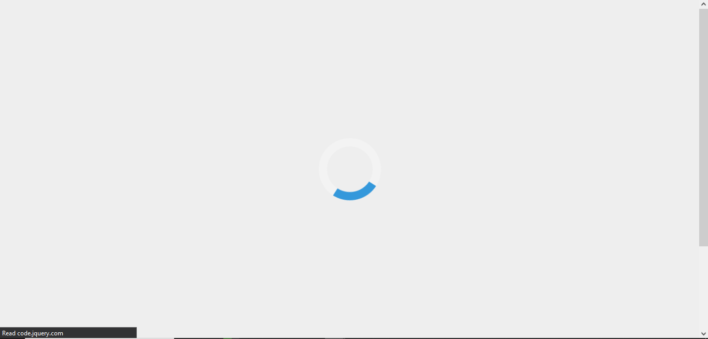

# Weather Forecast App

## 1. Project Purpose and Value

The Weather App is a dynamic and interactive web application designed to provide users with real-time weather data for any city or state. The project's primary purpose is to offer a user-friendly interface that allows users to easily access accurate weather information. The application fetches data from the api.weatherapi.com, providing detailed weather forecasts for the current day and the next 8 days.

### Value to Users:

- **Real-Time Weather Data:** Users can quickly obtain up-to-date weather information for their desired location.
- **User-Friendly Interface:** The application follows good UX principles, ensuring a seamless and intuitive user experience.
- **Dynamic and Interactive:** Users can search for any city or state, and the application dynamically updates the displayed weather data.
- **Feedback Mechanism:** Loading animations and notifications keep users informed about data retrieval status.

## 2. Development Rationale

The Weather Forecast App was developed to address the needs of users who require accurate and real-time weather information. It was designed with a clear purpose in mind, to provide users with reliable weather data to help them plan their activities based on the current weather conditions. Key considerations in the development rationale include:

### User Stories:

The user stories for this project included:

- As a user, I want to be able to search for any city or state to get the weather data for that region.
- As a user, I want to see the weather for the current day and the following eight days.
- As a user, I want to see a loading animation when the site is loading and a notification when data is being loaded.
- As a user, I want to receive an appropriate message if the region is not valid.

### Real-Life Audience:

The application is developed for a real-life audience, ensuring that the features and functionalities are tailored to actual user requirements.

## 3. Testing Principles

The Weather Forecast App was developed following good software development practices, which include both automated and manual testing. 

### Automated Testing:

Automated testing was performed using Jest, a JavaScript testing framework. This involved writing unit tests for the JavaScript functions used in the application, ensuring that the data is retrieved as it should from the API. 

### Manual Testing:

Manual testing was also performed to ensure that the application works as expected. This was essential for assessing the application's functionality, usability, and responsiveness. This includes testing user interactions, visual elements, and cross-browser compatibility. Manual testing was particularly important in this project to ensure that the application provides accurate and real-time weather data to users.

## 4. Testing Results

The results of the testing procedures indicated that the Weather Forecast App is fully functional and provides accurate weather data to users. The automated tests confirmed that the data is retrieved correctly from the API, while the manual tests ensured that the application works as expected and provides a good user experience.

## 5. Development Life Cycle Rationale

The development life cycle follows a structured approach, encompassing the following stages:

1. **Planning:** Clearly defined user stories and requirements drive the planning phase.
2. **Development:** Implementation of the application, ensuring adherence to good UX principles and best coding practices.
3. **Testing:** A combination of automated and manual testing to verify functionality, usability, and responsiveness.
4. **Deployment:** Deploying the fully functional application to GitHub Pages for public access.

## 6. Deployment Procedure

The deployment procedure involves the following steps:

1. **Code Review:** Ensure that the code is ready for deployment and adheres to best practices.
2. **Build Process:** Create a production-ready build of the application.
3. **GitHub Pages:** Deploy the application to GitHub Pages for public access.

To access the application, users can visit the following URL: [https://georgegerfen.github.io/InteractiveFrontendDevelopment/]
